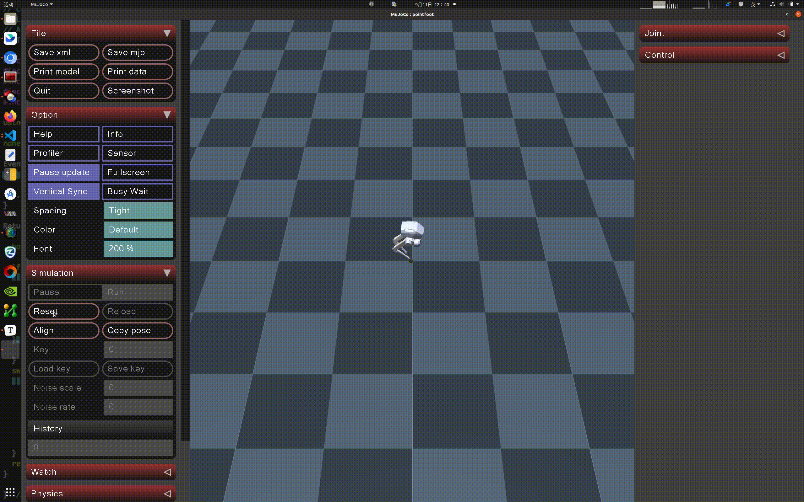

# rl-deploy-with-python

## Fork仓库进行的主要改动：
- 通过[bipedal_locomotion_isaaclab](https://github.com/Andy-xiong6/bipedal_locomotion_isaaclab)训练得到的policy中，关节顺序与原部署代码仓库不同，因此添加了校正关节顺序的代码，具体如下：     
  原来的关节顺序为：0: abad_L  1: hip_L   2: knee_L   3: abad_R    4: hip_R   5: knee_R   
  校正后的关节顺序：0: abad_L  1: abad_R  2: hip_L    3: hip_R     4: knee_L  5: knee_R   
  ```
  robot_state_aligned[0] = robot_state[0]
  robot_state_aligned[1] = robot_state[3]
  robot_state_aligned[2] = robot_state[1]
  robot_state_aligned[3] = robot_state[4]
  robot_state_aligned[4] = robot_state[2]
  robot_state_aligned[5] = robot_state[5]
  ```
- 发送关节控制指令时顺序也需要校正：
  ```
  robot_cmd.q[0] = actions[0] * action_scale_pos + init_joint_angles[0]
  robot_cmd.q[1] = actions[2] * action_scale_pos + init_joint_angles[2]
  robot_cmd.q[2] = actions[4] * action_scale_pos + init_joint_angles[4]
  robot_cmd.q[3] = actions[1] * action_scale_pos + init_joint_angles[1]
  robot_cmd.q[4] = actions[3] * action_scale_pos + init_joint_angles[3]
  robot_cmd.q[5] = actions[5] * action_scale_pos + init_joint_angles[5]
  
  ```

## 1. 运行仿真

- 打开一个 Bash 终端。

- 下载 MuJoCo 仿真器代码：

  ```
  git clone --recurse https://github.com/limxdynamics/pointfoot-mujoco-sim.git
  ```

- 安装运动控制开发库（如果尚未安装）：

  - Linux x86_64 环境

    ```
    pip install pointfoot-mujoco-sim/pointfoot-sdk-lowlevel/python3/amd64/limxsdk-*-py3-none-any.whl
    ```

  - Linux aarch64 环境

    ```
    pip install pointfoot-mujoco-sim/pointfoot-sdk-lowlevel/python3/aarch64/limxsdk-*-py3-none-any.whl
    ```

- 设置机器人类型

  - 通过 Shell 命令 `tree -L 1 pointfoot-mujoco-sim/robot-description/pointfoot` 列出可用的机器人类型：
  
    ```
    limx@limx:~$ tree -L 1 pointfoot-mujoco-sim/robot-description/pointfoot
    pointfoot-mujoco-sim/robot-description/pointfoot
    ├── PF_P441A
    ├── PF_P441B
    ├── PF_P441C
    └── PF_P441C2
    
    ```
  
  - 以`PF_P441C`（请根据实际机器人类型进行替换）为例，设置机器人型号类型：
  
    ```
    echo 'export ROBOT_TYPE=PF_P441C' >> ~/.bashrc && source ~/.bashrc
    ```
  
- 运行 MuJoCo 仿真器：

  ```
  python pointfoot-mujoco-sim/simulator.py
  ```
  


## 2. 运行控制算法

- 打开一个 Bash 终端。

- 下载控制算法代码：

  ```
  git clone --recurse https://github.com/limxdynamics/rl-deploy-with-python.git
  ```
  
- 安装运动控制开发库（如果尚未安装）：

  - Linux x86_64 环境

    ```
    pip install rl-deploy-with-python/pointfoot-sdk-lowlevel/python3/amd64/limxsdk-*-py3-none-any.whl
    ```

  - Linux aarch64 环境

    ```
    pip install rl-deploy-with-python/pointfoot-sdk-lowlevel/python3/aarch64/limxsdk-*-py3-none-any.whl
    ```

- 设置机器人类型

  - 通过 Shell 命令 `tree -L 1 rl-deploy-with-python/model/pointfoot` 列出可用的机器人类型：

    ```
    limx@limx:~$ tree -L 1 rl-deploy-with-python/model/pointfoot
    rl-deploy-with-python/model/pointfoot
    ├── PF_P441A
    ├── PF_P441B
    ├── PF_P441C
    └── PF_P441C2
    
    ```

  - 以`PF_P441C`（请根据实际机器人类型进行替换）为例，设置机器人型号类型：

    ```
    echo 'export ROBOT_TYPE=PF_P441C' >> ~/.bashrc && source ~/.bashrc
    ```

- 运行控制算法：

  ```
  python rl-deploy-with-python/pointfoot_controller.py
  ```

## 3. 虚拟遥控器

- 打开一个 Bash 终端。

- 运行 robot-joystick：

  ```
  ./pointfoot-mujoco-sim/robot-joystick/robot-joystick
  ```

## 4. 效果展示


